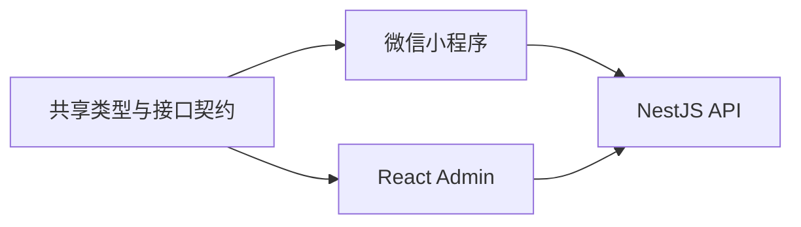
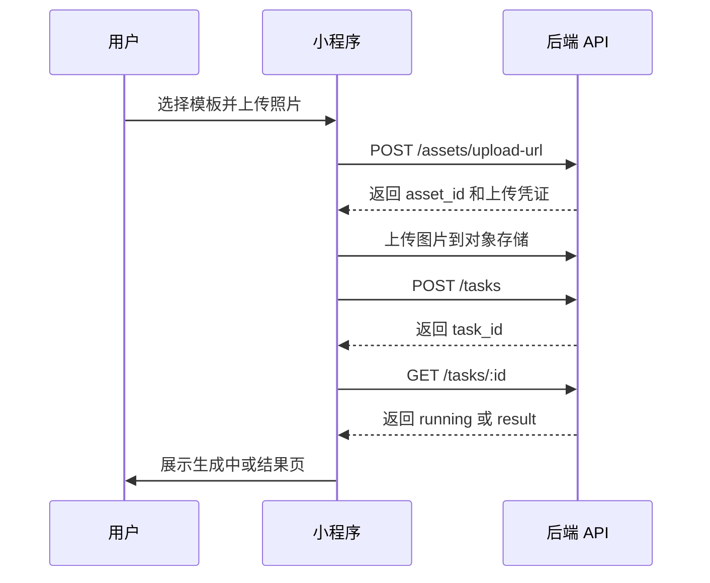

# 即变前端架构设计

更新时间：2026年08月01日  
适用范围：微信小程序、React 管理员端、共享 API 类型、前端状态和后端联调方式。

## 架构结论

即变前端分为微信小程序和 React 管理员端。小程序负责用户侧极短路径：浏览模板、上传照片、发起生成、查看结果、管理作品、积分和账号安全；React 管理员端负责运营侧配置：模板、prompt 编排、模型源 fallback、生成任务排障、审核和积分记录。两个前端都通过同一套 NestJS API 访问后端，不直连模型源、对象存储私钥、微信密钥或数据库。

## 前端拓扑



小程序使用微信原生框架继续演进，不在当前阶段重写。管理员端使用 `React + Vite + TypeScript`，通过 API service 层调用后端。后端 DTO、状态枚举和核心类型沉淀为共享包或 OpenAPI 生成类型，避免小程序、管理员端和后端字段不一致。

## 小程序职责

小程序只承载用户动作和结果展示，不承载真实业务规则。用户点击生成后，小程序提交图片、模板、比例和幂等 key；后端返回 `task_id` 后，小程序进入生成中状态并轮询 task。积分扣减、模型 fallback、审核、结果入库和失败退款都由后端执行。

当前小程序页面继续保留：

- `home`：模板发现入口。
- `search`、`inspiration`、`templates`、`favorites`：模板发现和收藏入口。
- `create`：上传图片、切换模板、选择比例、提交生成。
- `result`、`preview`：结果展示、全屏预览、分享入口。
- `gallery`、`gallery-manage`：作品列表、选择、删除。
- `profile`、`settings`、`settings-detail`、`phone-bind`、`account-delete`：用户资产与账号安全。
- `credits`、`redeem-code`、`credit-detail`、`membership`：积分、兑换码和会员占位。

## 小程序目录演进

当前页面结构不大改，只新增 API 配置、请求封装和 service 层：

```text
miniprogram/
  config/
    env.js
  utils/
    request.js
    system.js
  services/
    auth.js
    template.js
    asset.js
    generation.js
    userCreation.js
    credit.js
    account.js
  pages/
  components/
  data/
```

`data/templates.js` 在后端模板接口稳定前保留为 fallback。联调模式下，小程序优先读取 `GET /api/templates`；接口失败时使用本地模板，以保证 UI 调试不中断。

## 小程序 API 流程

用户生成流程按真实后端接口改造：



`create` 页面从本地 `setInterval` 模拟进度改为 task 轮询。轮询间隔使用后端返回的 `poll_interval_ms`，默认 2000ms；页面卸载时停止轮询。轮询返回 `succeeded` 或 `failed` 后停止。

## 小程序状态规则

小程序只维护 UI 状态和少量缓存：

- `auth_token`：登录态 token，存在本地缓存。
- `draft_image`：用户当前选择的本地临时图片，仅用于页面切换。
- `current_task_id`：当前生成任务 id，用于从生成页跳结果页。
- `template_cache`：模板列表缓存，用于接口失败时兜底。
- `profile_cache`：用户余额、手机号绑定状态和收藏状态的短期缓存。

小程序不再本地决定积分扣减、生成成功、兑换码有效、手机号绑定成功和注销申请成功。这些状态由后端返回，小程序只展示结果。

## 小程序接口封装

`utils/request.js` 统一封装 `wx.request`：

- 自动拼接 `API_BASE_URL`。
- 自动带上 `Authorization: Bearer <token>`。
- 统一处理 `401`，清理 token 并引导重新登录。
- 统一处理网络错误，页面展示轻量 toast，不出现全页白屏。
- 支持 `idempotency_key` 请求头，用于生成请求和支付类 action。

Service 层只暴露业务方法，例如 `generationService.createTask()`、`generationService.getTask()`、`creditService.redeemCode()`。页面不直接调用 `wx.request`。

## React 管理员端职责

管理员端负责把“模板驱动”和“任务可观测”做清楚。管理员可以配置模板、模型 fallback chain、价格、风险等级和上下架状态；也可以查看每一次生成任务的输入图、结果图、source runs、审核记录、扣费状态和失败原因。

管理员端不在浏览器里执行核心业务规则。所有上架、停用、审核、重跑、退款和模型源配置动作都调用后端 action API，由后端校验权限、写入数据库和审计日志。

## 管理员端 UI 参考基线

管理员端 UI 参考 `C:/code/my/JILIGULU/Frontend-Admin` 的建设方式，但不迁移它的业务文案、Logo、路由框架和 API 形态。即变管理员端继续按当前技术决策使用 `React + Vite + TypeScript`，只吸收 JILIGULU 后台的产品 UI 结构：暗色 app shell、固定侧边栏、模块页壳、统计卡、任务表格、状态徽标、确认弹窗和贴合内容结构的骨架屏。

参考项目的有效 UI 规则沉淀为即变后台的默认口径：

- `AppShell`：全局暗色背景、左侧固定导航、右侧内容滚动区，导航只承担模块切换，不承载业务表单。
- `ModulePageShell`：每个后台模块统一处理鉴权态、加载态、页面标题、筛选区和主体内容，避免页面各自实现布局。
- `Sidebar`：模块包含名称、图标、描述、权限 key 和高亮色；即变第一版模块映射为 Dashboard、Templates、Tasks、ReviewQueue、ModelProviders、Credits、Users。
- `Design Tokens`：使用 `background`、`surface`、`card`、`border`、`text-primary`、`text-secondary`、`text-muted`、`accent` 这类语义 token，不在页面里散落硬编码颜色。
- `Skeleton`：表格、详情页、统计卡、图表区域都使用形状匹配的骨架屏；禁止全页白屏加居中 Spinner。
- `Status Badge`：生成状态、审核状态、provider 健康状态、积分状态都使用统一 badge 体系，颜色只表达语义，不做装饰。

视觉上保持产品后台的克制密度。暗色主题可以继承参考项目的“深背景 + 半透明 surface + 单一 accent”方向，但即变需要重新命名品牌、模块和状态文案；紫蓝渐变只能作为主操作和当前选中态使用，不能泛化成所有卡片装饰。页面动效控制在 150-250ms，用于 hover、active、展开、弹窗和状态反馈，不做营销式入场动画。

## 管理员端页面

第一版管理员端包含 7 个主模块和 1 个详情页：

- `Dashboard`：展示今日生成量、成功率、失败率、模型源失败率、审核驳回率和队列积压。
- `Templates`：模板列表、创建模板、编辑封面、价格、结果数量、prompt variants 和 provider chain。
- `Tasks`：生成任务列表，支持按用户、模板、状态、时间和失败原因筛选。
- `TaskDetail`：展示 task、source runs、review records 和积分流水。
- `ReviewQueue`：输入审核和输出审核队列，支持通过、驳回和填写原因。
- `ModelProviders`：模型源启停、优先级、超时、额度、健康状态和测试调用。
- `Credits`：用户积分账户、积分流水、兑换码配置和充值记录。
- `Users`：用户列表、手机号绑定状态、积分余额、作品数量和账号状态。

## 管理员端流程编排

模板上架流程：

```text
创建模板
-> 上传封面
-> 填写用户端文案
-> 设置价格和结果数量
-> 配置 prompt variants
-> 配置 provider fallback chain
-> 保存为 draft
-> 测试生成
-> 发布为 published
```

任务排障流程：

```text
打开生成任务详情
-> 查看 task 状态
-> 展开 task
-> 查看 source_run
-> 判断失败原因
-> 重跑失败 task 或标记无需处理
```

审核流程：

```text
进入 ReviewQueue
-> 查看输入图或输出图
-> 查看命中策略和上下文
-> 点击通过或驳回
-> 后端写入 review_record
-> 结果可见性和 task 状态同步刷新
```

## 管理员端目录设计

```text
admin-web/
  src/
    app/
      router.tsx
      providers.tsx
      AppShell.tsx
    pages/
      Dashboard/
      Templates/
      Tasks/
      ReviewQueue/
      ModelProviders/
      Credits/
      Users/
    components/
      layout/
        AdminAppShell/
        AdminModulePageShell/
        Sidebar/
      ui/
        Skeleton/
        ConfirmDialog/
        StatusBadge/
        StatCard/
      TaskTimeline/
      SourceRunList/
      ReviewPanel/
      TemplateForm/
      AssetPreview/
    services/
      request.ts
      authApi.ts
      templateApi.ts
      generationApi.ts
      reviewApi.ts
      providerApi.ts
      creditApi.ts
    schemas/
      template.schema.ts
      provider.schema.ts
    types/
      api.ts
```

管理员端使用普通 React 状态管理即可。服务端状态使用 TanStack Query；表单使用 React Hook Form 和 Zod；复杂表格第一版使用轻量组件表格，等数据量增长后再引入虚拟列表。

## 共享类型

共享类型优先从后端 DTO 或 OpenAPI 生成，不手写多份。第一版必须统一这些枚举：

```ts
export type TaskStatus =
  | "running"
  | "succeeded"
  | "failed";

export type ReviewStatus =
  | "pending"
  | "approved"
  | "rejected"
  | "manual_required";
```

小程序可以用 JSDoc 或轻量类型文件承接这些状态；管理员端直接使用 TypeScript 类型。状态枚举只从后端定义生成，前端不自行新增状态。

## 结果展示

小程序结果页第一版按单图展示。接口返回 task 状态和 `result`，后续如果恢复多图并行，再重新引入结果数组或聚合层。

```json
{
  "task_id": "task_001",
  "status": "succeeded",
  "result": {
    "image_url": "https://cdn.example.com/result.webp",
    "review_status": "approved"
  }
}
```

未来模板配置 `result_count = 4` 后，再评估是否拆出结果表或任务聚合表，不在 MVP 提前设计。

## 环境配置

小程序和管理员端都按环境读取 API 地址：

```text
dev      http://localhost:3000
staging  https://staging-api.example.com
prod     https://api.example.com
```

小程序体验版和正式版必须使用微信后台已配置的合法域名。管理员端部署为静态资源，通过 Nginx 或对象存储静态站点访问后端 API。所有环境禁止在前端保存模型 API Key、微信 `appSecret`、支付密钥和对象存储私钥。

## UI 状态要求

小程序和管理员端都遵循产品 UI 状态规则：

- 加载态使用贴合内容结构的骨架屏，不使用全页白屏加居中 Spinner。
- 生成中展示明确任务状态、预计等待和可保留页面提示。
- 失败态保留用户输入，展示重试或返回入口。
- 审核拒绝态展示明确原因，不展示被拒结果图。
- 管理员端所有危险 action 使用二次确认，并写入审计日志。

## 联调顺序

1. 小程序接 `auth`、`templates` 和 `assets`，完成登录、模板接口和图片上传。
2. 小程序接 `tasks`，替换本地模拟生成。
3. 小程序接 `user_creations`、`favorites`、`credits` 和 `account`，替换本地缓存状态。
4. 管理员端搭建登录、布局、模板列表和生成任务列表。
5. 管理员端补齐任务详情、source runs、审核队列和模型源管理。

## 验收标准

- 当后端模板接口可用时，小程序首页、灵感页和玩法库展示后端模板；接口失败时展示本地 fallback 模板。
- 当用户在生成页提交图片和模板时，小程序调用真实上传和 `POST /tasks`，并用 `task_id` 轮询状态。
- 当后端返回 `result` 时，结果页展示结果图，并可进入预览页；图库页从 `GET /user-creations` 读取作品。
- 当管理员编辑模板并发布后，小程序重新拉取模板列表时展示新模板。
- 当管理员在任务详情页查看失败任务时，页面能展示 task、source run、审核记录和积分状态。
- 当前端触发上架、审核、重跑、停用 provider 和退款类动作时，后端写入审计日志，管理员端刷新后展示最新状态。
