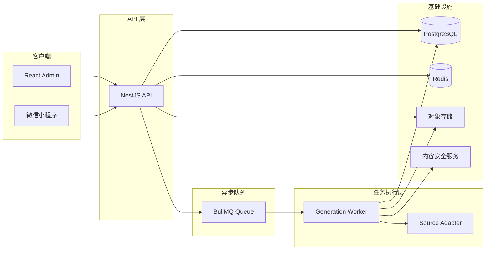
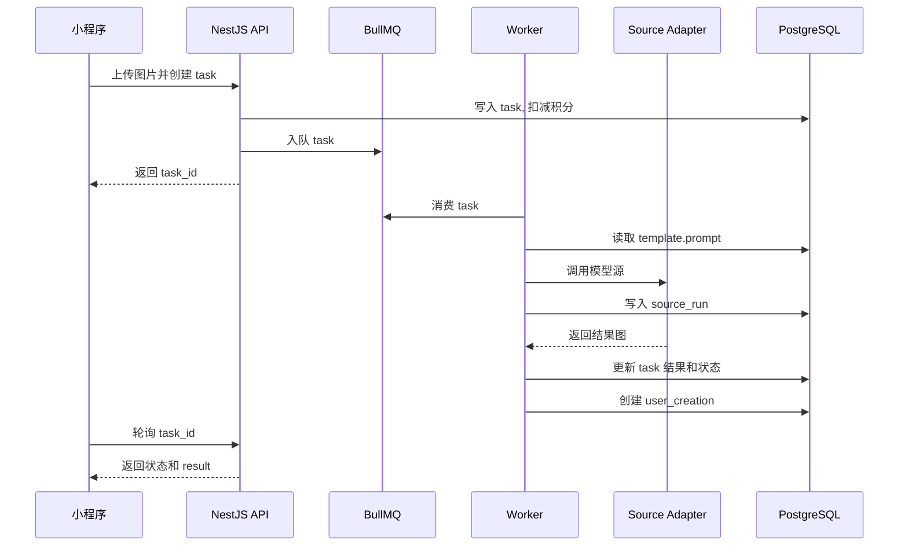

# 即变后端架构设计

更新时间：2026年08月01日  
适用范围：微信小程序、React 管理员端、AI 图片生成任务、内容审核、积分与作品管理。

## 架构结论

即变后端采用 `TypeScript + NestJS + PostgreSQL + Redis + BullMQ`。NestJS 承载用户 API、管理员 API 和任务 Worker；PostgreSQL 保存用户、模板、任务、源头调用、作品、积分和审核数据；Redis 承载队列、短期锁、限流和任务缓存；图片原图和生成结果进入对象存储。

MVP 建模保持简单：用户一次点击生成对应一条 `task`；每次调用模型源记录一条 `source_run`；单张结果图资产直接写回 `tasks.result_asset_id`。不再拆 `generation_request`、`generation_result`、`model_providers` 或 `template_provider_chains`，避免第一版过度抽象。

## 系统拓扑



API 服务保持无状态部署，所有业务状态写入 PostgreSQL。Worker 独立运行并按队列压力横向扩容。模型源 API Key、对象存储私钥、微信 `appSecret` 和管理员密码只存在服务端环境变量或密钥系统中，前端不接触。

## 服务模块

- `auth`：微信登录、管理员登录、token 签发、会话刷新。
- `users`：用户资料、手机号绑定状态、即时注销和账号状态。
- `templates`：玩法模板、封面、提示词、价格、结果数量、排序和上下架状态。
- `assets`：原图、结果图、封面图、对象存储地址和生命周期。
- `tasks`：生成任务创建、队列投递、轮询状态、失败原因和结果字段。
- `source_runs`：每次模型源头调用的 source ID、上游任务号、耗时、成本和错误日志。
- `review`：输入审核、输出审核、自动审核策略和驳回原因。
- `credits`：积分余额、扣减、失败退款、充值、兑换码和积分流水。
- `user_creations`：用户作品图库、作品删除、结果可见性和分享入口。
- `admin`：单管理员账号、ENV 启动同步、后台登录和后台 action API。

## 核心对象

`task` 是生成链路主事实表。它保存用户、模板、输入图、结果图、扣费状态、任务状态、审核可见性、耗时和失败原因。小程序创建任务后只轮询 `task_id`。

`source_run` 是模型源调用事实表。一次 task 可以产生一条或多条 source run，用于记录源头标识、第三方任务号、耗时、成本和错误信息。

`template` 是用户端玩法配置。MVP 中提示词直接存放在 `templates.prompt`，不再拆 prompt variant 表。

`user_creation` 是用户可见作品。只有结果审核通过并允许展示时，系统才基于 task 创建用户作品。

## 状态规则

`tasks.status` 只保留三个主状态：

- `running`：生成中，覆盖排队、输入审核、模型调用和输出审核。
- `succeeded`：生成成功且结果可见。
- `failed`：生成失败、输入审核失败或输出审核失败。

失败原因不扩展 task 主状态，统一写入 `tasks.error_message` 和审核记录。`tasks.credit_status` 使用 `none`、`charged`、`refunded`，用于追踪扣费和失败退款。

## 生成流程

用户在小程序生成页点击“开始生成”后，前端先上传图片，再提交 `template_id`、`input_asset_id`、`ratio` 和 `idempotency_key`。后端校验登录态、模板状态、图片归属、积分余额和重复提交，创建 `task`，立即扣减积分，并把 task 入队。

Worker 消费 task 后先执行输入审核。审核通过后，读取 `templates.prompt` 拼装标准化生成输入，并调用服务端配置的模型源 adapter。每次源头调用写入 `source_run`。调用成功后，Worker 保存结果图到对象存储并执行输出审核；输出审核通过后写入 `tasks.result_asset_id`、`tasks.is_visible = true` 和 `user_creation`。



## 标准生成输入

标准生成输入是即变内部协议，用来隔离产品业务字段和外部模型源字段差异。用户端、task 创建逻辑、Worker 和 source adapter 都围绕该协议对齐；任何源头特有字段不得反向污染标准协议，由对应 adapter 内部处理。

标准输入只定义三类字段：提示词、图片和比例。

```ts
export type GenerateRatio = "auto" | "1:1" | "3:4" | "4:3" | "9:16" | "16:9";

export type StandardGenerateInput = {
  prompt: string;
  imageUrl: string;
  ratio: GenerateRatio;
};
```

字段来源：`prompt` 来自 `templates.prompt`；`imageUrl` 由 `tasks.input_asset_id` 对应的 asset 生成临时访问地址；`ratio` 来自用户端创建 task 时提交的比例。没有在标准输入中声明的字段，例如 seed、风格强度、第三方私有参数、回调地址和鉴权信息，都由具体 source adapter 或服务端配置自行处理。

## 进度机制

用户端生成进度不是模型内部真实进度，而是基于历史成功任务耗时计算出的展示进度。目标是在不写入频繁进度状态、不依赖模型源实时回调的前提下，让小程序轮询得到稳定、可信的等待反馈。

系统维护 `generation_time_anchors` 作为时间锚点表。MVP 只按 `result_count` 分桶，例如 1 张、2 张、3 张或 4 张结果分别维护一条耗时锚点。任务成功且结果通过输出审核后，后端按该 task 的 `expected_result_count` 读取最新成功任务的 `duration_ms`，计算平均值并 upsert 锚点；样本数量限制写在代码常量里，不单独落库。`duration_ms` 表示用户点击创建到任务结束的总耗时，由 `finished_at - created_at` 计算。

轮询 `GET /api/tasks/:id` 时不把进度写回数据库，而是实时投射：无历史锚点时默认 `anchor_duration_seconds = 30`；运行中 task 使用 `elapsed_seconds / anchor_duration_seconds` 计算进度并封顶到 99%；终态成功返回 100%。

## 模型源调用

MVP 不建模型源配置表。模型源选择、API Key、超时和 fallback 策略先由服务端配置或代码常量控制；调用事实只落到 `source_runs.source_id`。这样表结构更轻，后续确实需要后台动态配置模型源时，再引入独立配置表。

每个 source adapter 实现统一接口：

```ts
interface SourceAdapter {
  sourceId: string;

  generate(input: StandardGenerateInput): Promise<{
    imageUrl: string;
    upstreamJobId?: string;
    rawResponse?: unknown;
    costAmount?: number;
  }>;
}
```

Source adapter 不直接写业务表，不处理积分和审核。Worker 负责创建 `source_run`、保存结果、执行审核和更新 task 状态，保证模型适配逻辑和业务状态流转解耦。

## 审核策略

输入审核发生在模型调用前，审核对象包括用户原图、模板风险等级和最终 prompt。输入审核失败时，task 进入 `failed`，系统写入退款流水并退回已扣积分，不创建 `source_run`。

输出审核发生在模型返回后，审核对象是结果图和必要元数据。输出审核通过后结果资产写入 task 并展示给用户；输出审核失败时，task 进入 `failed`，保留 source run 和结果 asset 记录用于排障，但 `tasks.is_visible = false`。

当前版本不设置人工审核池，也不提供人工通过/驳回动作。管理员端只展示自动审核观测数据、失败原因和审核总开关；机器审核不通过时任务直接失败并按扣费规则退款。

## API 契约

### 小程序 API

- `POST /api/auth/wechat-login`：提交 `code`，返回 `access_token`、`user`、`credit_balance`。
- `GET /api/templates`：返回已上架模板、分类、价格、封面和结果数量。
- `POST /api/assets/upload-url`：申请上传凭证，返回对象存储上传地址和 `asset_id`。
- `POST /api/tasks`：创建生成任务，返回 `task_id`、`status`、`poll_interval_ms`。
- `GET /api/tasks/:id`：返回 task 状态、进度、可见结果和失败原因。
- `GET /api/user-creations`：返回用户作品列表。
- `DELETE /api/user-creations/:id`：删除用户作品，作品状态更新为 `deleted`。
- `POST /api/favorites/:template_id`：收藏模板。
- `DELETE /api/favorites/:template_id`：取消收藏。
- `GET /api/credits/balance`：返回可用余额。
- `POST /api/redeem-codes/redeem`：兑换积分码。
- `POST /api/account/deletion-requests`：立即注销当前账号并清理用户资料。

### 管理员 API

- `POST /api/admin/login`：提交管理员用户名和密码，成功后签发后台 token。
- `GET /api/admin/templates`：模板列表。
- `POST /api/admin/templates`：创建模板。
- `PATCH /api/admin/templates/:id`：更新模板、提示词、价格、封面、排序和上下架状态。
- `GET /api/admin/tasks`：生成任务列表，支持用户、模板、状态、时间筛选。
- `GET /api/admin/tasks/:id`：任务详情，包含 task、source_runs、review records 和积分流水。
- `POST /api/admin/tasks/:id/rerun`：重跑指定 task。
- `GET /api/v1/admin/moderation/overview`：自动审核概览。
- `GET /api/v1/admin/moderation/events`：自动审核事件列表。
- `PUT /api/v1/admin/moderation/config`：启停自动审核总开关。

## 幂等和一致性

小程序创建生成任务时必须提交 `idempotency_key`，同一用户在短时间内重复提交同一个 key 时，后端返回已创建的 `task_id`，不重复扣减积分。

积分扣减、退款和 task 创建必须在数据库事务中完成。生成失败、输入审核失败或输出审核失败时，系统写入退款流水并把 `tasks.credit_status` 更新为 `refunded`。

结果写入遵循“先保存 asset，再更新 task 状态和结果字段”。删除作品只更新 `user_creations.status = deleted`，不立即物理删除 asset，后台清理任务按生命周期执行。

## 部署运维

生产形态保持同一镜像多角色启动：

```text
api-server      NestJS HTTP API
worker          BullMQ generation worker
admin-web       React 静态资源 + Nginx
postgres        PostgreSQL
redis           Redis
```

API 和 Worker 读取相同环境变量：`DATABASE_URL`、`REDIS_URL`、`JWT_SECRET`、`COS_SECRET_REF`、`WECHAT_APP_ID`、`WECHAT_APP_SECRET`。API 额外读取 `ADMIN_USERNAME`、`ADMIN_PASSWORD`，并在容器启动时同步覆盖 `admin_users.username` 和 `admin_users.password_hash`。

系统记录 task 和 source run 两层耗时。管理员端展示生成成功率、源头失败率、平均耗时、队列等待时长、审核驳回率和积分扣退情况。每次 source run 记录 `source_id`、`upstream_job_id`、`latency_ms`、`error_code` 和 `cost_amount`，用于判断源头是否需要降级或停用。

## 交付顺序

1. 搭建 NestJS、Prisma、PostgreSQL、Redis、BullMQ 和 Docker Compose。
2. 实现微信登录、模板列表、对象存储上传、创建 task、轮询 task 状态。
3. 实现 Worker、source adapter、source run 记录、结果保存和图库接口。
4. 实现积分扣减、失败退款、兑换码和积分流水。
5. 实现管理员端所需的模板管理、任务日志、自动审核观测和用户查询 API。

## 验收标准

- 当小程序提交图片、模板和比例时，后端创建一条 `task`，返回 `task_id`。
- 当模型源调用失败时，Worker 写入失败的 `source_run`，并按服务端 fallback 策略决定是否重试或切换源头。
- 当结果通过输出审核时，系统写入 `tasks.result_asset_id` 和 `user_creation`，小程序轮询接口返回可展示的结果图。
- 当 task 失败时，task 状态为 `failed`，已扣积分退回，`credit_ledger` 存在退款记录。
- 当管理员查看任务详情时，页面能展示 task、source run、审核记录和积分流水。
