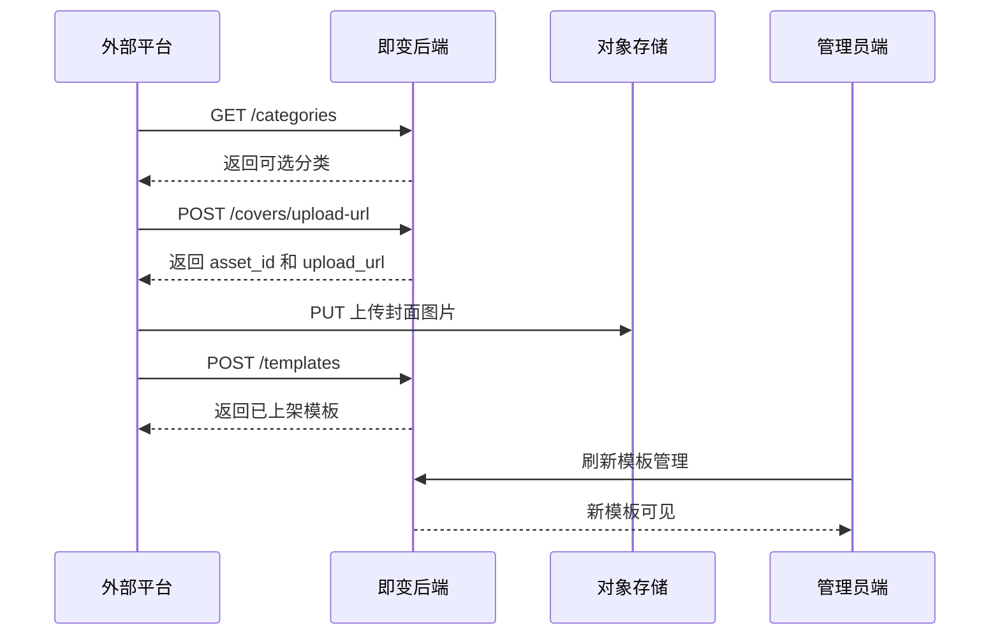

# 即变_模板自动写入接口使用手册

## 1. 接入目的

Template Ingest API 用于让外部平台把已经生产好的模板信息写入即变后台。调用方完成分类选择、封面上传、模板创建后，模板会以 `published` 状态直接上架，并出现在管理员端模板管理列表中。

本接口只面向可信外部平台开放，不使用管理员登录态。服务端通过固定环境变量 `TEMPLATE_INGEST_API_KEY` 鉴权，调用方在每次请求中携带 `X-Template-Ingest-Key` 请求头。

## 2. 接入前准备

后端部署环境需要配置 `TEMPLATE_INGEST_API_KEY`。该 key 由即变服务端维护，不在管理员端发放，也不提供前端页面管理。调用方需要把 key 保存在服务端配置或密钥系统中，不能写入浏览器、小程序、公开仓库或客户端包体。

接口地址统一使用：

```text
{API_BASE_URL}/api/v1/template-ingest
```

生产环境示例：

```text
https://api.jibian.art/api/v1/template-ingest
```

所有业务请求都需要带：

```http
X-Template-Ingest-Key: <TEMPLATE_INGEST_API_KEY>
Content-Type: application/json
```

## 3. 标准接入流程

外部平台按固定三步完成模板写入：先查询现有分类，再申请封面上传地址并上传封面，最后创建模板。创建模板时只能使用现有分类和已上传成功的封面 `asset_id`。



## 4. 查询可用分类

调用方必须先读取分类列表，并从 `data.items[].name` 中选择一个分类写入模板。接口不会创建新分类，传入不存在的分类会创建失败。

```http
GET /api/v1/template-ingest/categories
```

请求示例：

```bash
curl -X GET "https://api.jibian.art/api/v1/template-ingest/categories" \
  -H "X-Template-Ingest-Key: $TEMPLATE_INGEST_API_KEY"
```

响应示例：

```json
{
  "success": true,
  "data": {
    "items": [
      {
        "id": "00000000-0000-4000-8000-000000000001",
        "name": "写真",
        "display_name": "写真",
        "sort_order": 0
      }
    ],
    "total": 1
  }
}
```

字段规则：

| 字段 | 含义 | 使用方式 |
| --- | --- | --- |
| `id` | 分类内部 ID | 仅用于展示或排查，不作为创建模板参数 |
| `name` | 分类写入值 | 创建模板时传入 `category` |
| `display_name` | 分类展示名 | 外部平台展示给运营人员选择 |
| `sort_order` | 分类排序 | 外部平台只读，不参与模板排序 |

## 5. 创建封面上传地址

调用方通过封面上传接口获取 `asset_id` 和 `upload_url`。后端会固定创建 `template_cover` 类型资产，调用方不能传入自定义 `asset_type`。

```http
POST /api/v1/template-ingest/covers/upload-url
```

请求体：

```json
{
  "content_type": "image/webp"
}
```

`content_type` 只允许以下值：

| 值 | 说明 |
| --- | --- |
| `image/jpeg` | JPEG 封面 |
| `image/png` | PNG 封面 |
| `image/webp` | WebP 封面 |
| `image/gif` | GIF 封面 |

请求示例：

```bash
curl -X POST "https://api.jibian.art/api/v1/template-ingest/covers/upload-url" \
  -H "X-Template-Ingest-Key: $TEMPLATE_INGEST_API_KEY" \
  -H "Content-Type: application/json" \
  -d '{"content_type":"image/webp"}'
```

响应示例：

```json
{
  "success": true,
  "data": {
    "asset_id": "00000000-0000-4000-8000-000000000002",
    "storage_key": "template_cover/admin/1785730000000-uuid.webp",
    "upload_url": "https://storage.example.com/upload-url",
    "public_url": "https://assets.example.com/template_cover/admin/1785730000000-uuid.webp"
  }
}
```

调用方需要保存 `asset_id`，创建模板时传入 `cover_asset_id`。`public_url` 用于上传后预览和排查，不作为创建模板的参数。

## 6. 上传封面文件

拿到 `upload_url` 后，调用方直接对该地址发起 `PUT` 请求上传图片二进制内容。上传请求不需要携带 `X-Template-Ingest-Key`，但必须使用申请上传地址时相同的 `Content-Type`。

```bash
curl -X PUT "$UPLOAD_URL" \
  -H "Content-Type: image/webp" \
  --data-binary "@cover.webp"
```

上传成功后，对象存储通常返回 `200`、`201` 或 `204`。创建模板前，调用方需要确认上传请求已经成功完成，否则后端会在创建模板时返回 `Cover asset is not uploaded or reachable`。

## 7. 创建并上架模板

创建模板接口会写入模板基础信息，并固定把模板状态设为 `published`。调用方不能传 `status` 和 `sort_order`；排序由后端按当前分类内最大 `sort_order + 10` 自动追加。

```http
POST /api/v1/template-ingest/templates
```

请求体：

```json
{
  "name": "清透珠光写真",
  "category": "写真",
  "cover_asset_id": "00000000-0000-4000-8000-000000000002",
  "prompt": "将用户上传的人物照片转换为清透、有珠光质感的人像写真。",
  "price_credits": 6,
  "result_count": 1,
  "external_id": "external-template-20260803-001"
}
```

请求示例：

```bash
curl -X POST "https://api.jibian.art/api/v1/template-ingest/templates" \
  -H "X-Template-Ingest-Key: $TEMPLATE_INGEST_API_KEY" \
  -H "Content-Type: application/json" \
  -d '{
    "name": "清透珠光写真",
    "category": "写真",
    "cover_asset_id": "00000000-0000-4000-8000-000000000002",
    "prompt": "将用户上传的人物照片转换为清透、有珠光质感的人像写真。",
    "price_credits": 6,
    "result_count": 1,
    "external_id": "external-template-20260803-001"
  }'
```

响应示例：

```json
{
  "success": true,
  "data": {
    "id": "00000000-0000-4000-8000-000000000003",
    "name": "清透珠光写真",
    "category": "写真",
    "cover_asset_id": "00000000-0000-4000-8000-000000000002",
    "prompt": "将用户上传的人物照片转换为清透、有珠光质感的人像写真。",
    "price_credits": 6,
    "result_count": 1,
    "sort_order": 30,
    "status": "published"
  }
}
```

## 8. 创建模板字段规则

| 字段 | 必填 | 类型 | 规则 |
| --- | --- | --- | --- |
| `name` | 是 | string | 模板名称，最长 80 字符，不能为空字符串 |
| `category` | 是 | string | 必须等于现有分类的 `name`，最长 64 字符 |
| `cover_asset_id` | 是 | uuid | 必须来自封面上传接口返回的 `asset_id` |
| `prompt` | 是 | string | 模板生成提示词，不能为空字符串 |
| `price_credits` | 是 | integer | 单次生成消耗积分，最小值 0 |
| `result_count` | 否 | integer | 生成结果数量，默认 1，最小值 1 |
| `external_id` | 否 | string | 外部平台侧模板标识，最长 128 字符，当前版本不落库 |

系统自动写入：

| 字段 | 写入规则 |
| --- | --- |
| `status` | 固定写入 `published` |
| `sort_order` | 当前分类下模板最大 `sort_order + 10` |
| `coverAssetId` | 由 `cover_asset_id` 映射写入 |
| `priceCredits` | 由 `price_credits` 映射写入 |
| `resultCount` | 由 `result_count` 映射写入 |

## 9. 错误处理

接口错误会返回标准 HTTP 状态码和 `message`。调用方应按错误类型决定是否重试：鉴权和字段错误需要修正请求后再提交，上传未完成需要重新确认封面上传状态。

| HTTP 状态码 | message | 处理方式 |
| --- | --- | --- |
| `401` | `Missing template ingest key` | 补充 `X-Template-Ingest-Key` |
| `401` | `Invalid template ingest key` | 检查 key 是否与后端环境变量一致 |
| `503` | `Template ingest key is not configured` | 联系即变后端配置 `TEMPLATE_INGEST_API_KEY` |
| `400` | `Category does not exist` | 重新调用分类接口并选择已有分类 |
| `400` | `Cover asset not found` | 使用封面上传接口返回的 `asset_id` |
| `400` | `Cover asset must be template_cover` | 重新通过封面上传接口创建封面资产 |
| `400` | `Cover asset is not uploaded or reachable` | 确认 `PUT upload_url` 已成功完成 |
| `400` | `name is required` | 填写非空模板名称 |
| `400` | `category is required` | 填写现有分类名称 |
| `400` | `prompt is required` | 填写非空提示词 |

## 10. 排序与可见性

模板创建成功后立即上架。管理员端刷新模板管理页后可以看到新增模板，用户端模板列表只展示 `published` 模板，因此创建成功的模板也会进入用户端可见范围。

排序只在分类内追加，不做全局排序。外部平台连续向同一分类写入模板时，后端会按创建顺序递增 `sort_order`；写入不同分类时，各分类独立计算，不会互相影响。

## 11. 完整调用样例

下面是一条最小可用链路。调用方需要把 `TEMPLATE_INGEST_API_KEY`、`UPLOAD_URL` 和 `COVER_ASSET_ID` 替换为实际值。

```bash
# 1. 查询分类
curl -X GET "https://api.jibian.art/api/v1/template-ingest/categories" \
  -H "X-Template-Ingest-Key: $TEMPLATE_INGEST_API_KEY"

# 2. 获取封面上传地址
curl -X POST "https://api.jibian.art/api/v1/template-ingest/covers/upload-url" \
  -H "X-Template-Ingest-Key: $TEMPLATE_INGEST_API_KEY" \
  -H "Content-Type: application/json" \
  -d '{"content_type":"image/webp"}'

# 3. 上传封面
curl -X PUT "$UPLOAD_URL" \
  -H "Content-Type: image/webp" \
  --data-binary "@cover.webp"

# 4. 创建模板
curl -X POST "https://api.jibian.art/api/v1/template-ingest/templates" \
  -H "X-Template-Ingest-Key: $TEMPLATE_INGEST_API_KEY" \
  -H "Content-Type: application/json" \
  -d '{
    "name": "清透珠光写真",
    "category": "写真",
    "cover_asset_id": "'"$COVER_ASSET_ID"'",
    "prompt": "将用户上传的人物照片转换为清透、有珠光质感的人像写真。",
    "price_credits": 6,
    "result_count": 1
  }'
```

## 12. 上线检查

接入上线前需要完成以下检查：

1. 后端运行环境已配置 `TEMPLATE_INGEST_API_KEY`，且外部平台使用同一个 key。
2. 外部平台通过服务端发起请求，不在客户端暴露 key。
3. 分类选择来自 `GET /categories` 返回值，不允许人工拼写新分类。
4. 封面文件上传成功后再调用创建模板接口。
5. 创建成功后检查响应 `status = published`，并在管理员端模板管理页确认新模板可见。
6. 写入同一分类多个模板后，确认新增模板出现在该分类末尾。

