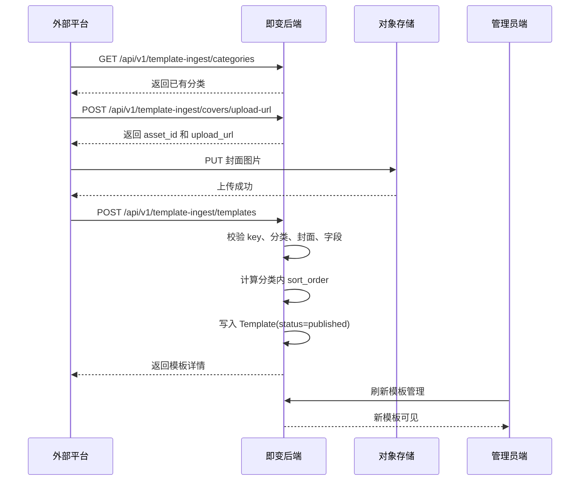

# 即变_模板自动写入接口方案

## 1. 背景

当前即变模板搭建主要依赖管理员端手动录入，包括模板名称、分类、封面、价格、提示词、排序和上架状态。

为了提升模板生产效率，后续会有一个外部平台负责生成或维护模板素材与提示词。即变后端需要开放一组面向外部平台的写入接口，让外部平台可以在不登录管理员端的情况下，安全地写入模板。写入完成后，模板应默认上架，并能直接在管理员端模板管理页看到。

本方案只覆盖模板写入链路，不引入管理员端密钥管理页面，不新增复杂权限系统，不改用户端生成任务主流程。

## 2. 目标

1. 提供一组可被外部平台直接调用的模板写入接口。
2. 使用环境变量中的固定 key 鉴权，不依赖管理员登录态。
3. 支持模板名称、价格、分类、封面、提示词等模板搭建字段写入。
4. 分类只能选择现有分类，不允许外部平台新建分类。
5. 封面通过独立接口获取上传凭证，再在创建模板时引用 `cover_asset_id`。
6. 写入成功后模板默认上架，管理员端可以直接看到。
7. 保持实现简单、可审计、可回滚，不引入多租户、密钥发放、密钥管理和复杂审批能力。

## 3. 命名

建议命名为 **Template Ingest API**。

原因：

- `Template` 明确表示模板域能力。
- `Ingest` 表示外部系统向内部系统灌入/导入内容，适合自动化写入场景。
- 不使用 `Admin`，避免误解为管理员登录态接口。
- 不使用 `Open API`，避免暗示这是面向所有第三方的开放平台。

建议命名约定：

| 类型 | 名称 |
| --- | --- |
| 模块 | `TemplateIngestModule` |
| Controller | `TemplateIngestController` |
| Service | `TemplateIngestService` |
| Guard | `TemplateIngestGuard` |
| 环境变量 | `TEMPLATE_INGEST_API_KEY` |
| Header | `X-Template-Ingest-Key` |
| 路由前缀 | `/api/v1/template-ingest` |

## 4. 鉴权方案

### 4.1 鉴权方式

外部平台每次请求都需要带：

```http
X-Template-Ingest-Key: <TEMPLATE_INGEST_API_KEY>
```

后端从 `ConfigService` 读取 `TEMPLATE_INGEST_API_KEY`，并和请求 Header 做常量时间比较。

### 4.2 鉴权失败规则

- 未配置 `TEMPLATE_INGEST_API_KEY`：生产环境下接口返回 `503 Service Unavailable`。
- 未传 Header：返回 `401 Unauthorized`。
- Header 不匹配：返回 `401 Unauthorized`。

### 4.3 不做的事情

- 不在管理员端发放密钥。
- 不提供密钥列表、禁用、轮换 UI。
- 不为外部平台建立独立账号体系。
- 不把这个 key 写入数据库。

密钥轮换通过更新服务端 env 完成。

## 5. 接口设计

### 5.1 查询可用分类

外部平台需要先获取现有分类，并从返回结果中选择分类。

```http
GET /api/v1/template-ingest/categories
X-Template-Ingest-Key: <key>
```

响应：

```json
{
  "success": true,
  "data": {
    "items": [
      {
        "name": "写真",
        "display_name": "写真",
        "sort_order": 0
      }
    ],
    "total": 1
  }
}
```

规则：

- 只返回已有分类。
- 按 `sort_order asc, created_at asc` 排序。
- 不提供创建分类能力。

### 5.2 创建封面上传凭证

外部平台先调用此接口获取封面上传 URL，再使用 `PUT` 把图片上传到对象存储。

```http
POST /api/v1/template-ingest/covers/upload-url
X-Template-Ingest-Key: <key>
Content-Type: application/json
```

请求：

```json
{
  "content_type": "image/webp"
}
```

响应：

```json
{
  "success": true,
  "data": {
    "asset_id": "00000000-0000-4000-8000-000000000001",
    "storage_key": "template_cover/admin/1785730000000-uuid.webp",
    "upload_url": "https://...",
    "public_url": "https://..."
  }
}
```

规则：

- 后端固定 `asset_type = template_cover`。
- 外部平台不能传任意 asset_type。
- `content_type` 只允许图片 MIME 类型，建议支持：
  - `image/jpeg`
  - `image/png`
  - `image/webp`
  - `image/gif`
- 返回的 `asset_id` 用于创建模板。
- `public_url` 主要用于外部平台调试预览，不作为创建模板的必填字段。

### 5.3 创建并上架模板

```http
POST /api/v1/template-ingest/templates
X-Template-Ingest-Key: <key>
Content-Type: application/json
```

请求：

```json
{
  "name": "清透珠光写真",
  "category": "写真",
  "cover_asset_id": "00000000-0000-4000-8000-000000000001",
  "prompt": "将用户上传的人物照片转换为清透、有珠光质感的人像写真。",
  "price_credits": 6,
  "result_count": 1,
  "external_id": "optional-template-id-from-platform"
}
```

响应：

```json
{
  "success": true,
  "data": {
    "id": "00000000-0000-4000-8000-000000000002",
    "name": "清透珠光写真",
    "category": "写真",
    "cover_asset_id": "00000000-0000-4000-8000-000000000001",
    "prompt": "将用户上传的人物照片转换为清透、有珠光质感的人像写真。",
    "price_credits": 6,
    "result_count": 1,
    "sort_order": 30,
    "status": "published"
  }
}
```

规则：

- `name` 必填，最长 80。
- `category` 必填，必须命中现有 `template_categories.name`。
- `cover_asset_id` 必填或强烈建议必填，必须存在，且 `asset.assetType = template_cover`。
- `prompt` 必填，写入 `Template.prompt`，生成任务会直接使用。
- `price_credits` 必填，非负整数。
- `result_count` 可选，默认 `1`，最小 `1`。
- `status` 不允许外部传，后端固定写 `published`。
- `sort_order` 不允许外部传，后端自动写入当前分类末尾。
- `external_id` 第一版可以先只作为请求字段预留，不落库；如果要强幂等，需要后续加表或字段。

## 6. 字段完整性检查

当前模板表字段如下：

| 字段 | 是否需要外部写入 | 规则 |
| --- | --- | --- |
| `name` | 是 | 模板名称 |
| `category` | 是 | 只能选择已有分类 |
| `cover_asset_id` | 是 | 通过封面上传接口获得 |
| `prompt` | 是 | 生成任务实际使用的提示词 |
| `price_credits` | 是 | 单次生成消耗积分 |
| `result_count` | 可选 | 默认 1 |
| `sort_order` | 否 | 后端自动计算 |
| `status` | 否 | 后端固定 `published` |

目前生成主链路还会使用：

- `Template.prompt`：生成任务提交给标准生成层。
- `Template.priceCredits`：创建任务时扣减积分。
- `Template.resultCount`：创建任务时写入 `expectedResultCount`，并影响进度估算。
- `Template.status`：用户端只允许使用 `published` 模板。

因此第一版不需要额外字段即可完成可用模板搭建。

## 7. 排序策略

外部平台不负责排序，避免破坏管理员端按分类排序的规则。

创建模板时，后端自动计算：

```text
sort_order = 当前 category 下模板最大 sort_order + 10
```

如果当前分类没有模板：

```text
sort_order = 10
```

说明：

- 使用步长 10，方便后续管理员端手动插入排序。
- 排序只在分类内有意义，不做全局排序。
- 管理员端仍可后续拖拽调整分类内排序。

## 8. 错误码约定

| 场景 | HTTP 状态码 | message |
| --- | --- | --- |
| 缺少 key | 401 | `Missing template ingest key` |
| key 不正确 | 401 | `Invalid template ingest key` |
| 服务端未配置 key | 503 | `Template ingest key is not configured` |
| 分类不存在 | 400 | `Category does not exist` |
| 封面不存在 | 400 | `Cover asset not found` |
| 封面类型错误 | 400 | `Cover asset must be template_cover` |
| 封面未上传或不可访问 | 400 | `Cover asset is not uploaded or reachable` |
| 名称为空 | 400 | `name is required` |
| prompt 为空 | 400 | `prompt is required` |
| price 不合法 | 400 | `price_credits must be a non-negative integer` |

## 9. 实现方案

### 9.1 新增文件

建议新增：

```text
Backend/src/template-ingest/template-ingest.module.ts
Backend/src/template-ingest/template-ingest.controller.ts
Backend/src/template-ingest/template-ingest.service.ts
Backend/src/template-ingest/template-ingest.guard.ts
Backend/src/template-ingest/dto/create-template-ingest.dto.ts
Backend/src/template-ingest/dto/create-cover-upload-url.dto.ts
```

### 9.2 模块依赖

`TemplateIngestModule` 依赖：

- `AssetsModule`
- `TemplatesModule` 或直接使用 `PrismaService`
- 全局 `PrismaService`
- 全局 `ConfigService`

推荐 `TemplateIngestService` 直接用 `PrismaService` 写入模板，原因：

- 外部写入需要额外做分类校验、封面校验、排序自动计算、默认上架。
- 现有 `TemplatesService.createAdmin()` 偏管理员端 DTO，需要外部调用方传 `sort_order/status`，不适合直接复用。

### 9.3 AppModule 挂载

在 `Backend/src/app.module.ts` 加入：

```ts
import { TemplateIngestModule } from "./template-ingest/template-ingest.module";
```

并加入 imports：

```ts
TemplateIngestModule,
```

### 9.4 环境变量

`.env.example` 增加：

```env
# External template ingest API
TEMPLATE_INGEST_API_KEY=
```

`docker-compose.yml` 增加：

```yaml
TEMPLATE_INGEST_API_KEY: ${TEMPLATE_INGEST_API_KEY:-}
```

`scripts/smoke-env.ts` 建议增加 warning：

- 如果生产环境没有配置 `TEMPLATE_INGEST_API_KEY`，提示 `Template Ingest disabled`。
- 不作为严格失败项，除非决定该能力上线即必需。

## 10. 调用流程



## 11. 验收标准

1. 未携带 `X-Template-Ingest-Key` 调用任意 ingest 接口，返回 401。
2. 携带错误 key 调用任意 ingest 接口，返回 401。
3. 携带正确 key 能获取现有分类列表。
4. 携带正确 key 能获取模板封面上传 URL。
5. 上传封面后，使用返回的 `asset_id` 能创建模板。
6. 创建模板时传不存在的分类，返回 400，且不写入模板。
7. 创建模板时传非 `template_cover` asset，返回 400，且不写入模板。
8. 创建模板成功后，模板 `status = published`。
9. 创建模板成功后，管理员端模板管理列表能看到该模板。
10. 新模板排序落在所选分类末尾，不影响其他分类排序。
11. 用户端 `/api/templates` 能看到该模板。
12. 后端 `npm run build` 通过。
13. Prisma schema 不需要变更。

## 12. 后续增强

第一版不做，但建议记录：

1. **幂等写入**：如果外部平台会重试，建议新增 `external_id` 唯一索引或单独 `template_ingest_records` 表。
2. **审计日志**：记录外部平台每次创建模板的请求摘要和结果。
3. **灰度状态**：未来可支持默认 `draft`，由管理员审核后上架。
4. **批量写入**：未来可增加 batch create，但第一版不做，避免批量失败回滚复杂度。
5. **远程图片拉取**：未来可支持传 `cover_url`，由后端拉取并落库；第一版先使用预签名上传，风险更低。

## 13. 推荐第一版开发顺序

1. 新增 `TemplateIngestGuard`，完成 env key 鉴权。
2. 新增 `GET /categories`，返回现有分类。
3. 新增 `POST /covers/upload-url`，复用 `AssetsService.createUploadUrlForAdmin()`。
4. 新增 `POST /templates`，做字段校验、分类校验、封面校验、分类内排序、默认上架。
5. 补 `.env.example` 和 `docker-compose.yml`。
6. 跑后端 `npm run build`。
7. 用一条真实调用链验证：分类列表 -> 封面上传 URL -> PUT 图片 -> 创建模板 -> 管理员端可见。

## 14. Agent 模板管理扩展

为了让 Agent 直接维护模板库，Template Ingest API 扩展为模板运营管理入口。所有接口继续使用 `X-Template-Ingest-Key` 鉴权，不复用管理员登录态，不新增数据库表，不改变用户端生成主链路。

### 14.1 上下文聚合

```http
GET /api/v1/template-ingest/agent-context
```

返回模板列表、分类列表、可用资产、首页运营位和全局价格设置。Agent 在开始批量决策前先调用该接口建立上下文，避免在缺少模板 ID、分类 ID 或价格规则时盲目写入。

### 14.2 模板管理

| 能力 | 接口 | 规则 |
| --- | --- | --- |
| 查询模板列表 | `GET /templates` | 支持 `page`、`page_size`、`q`、`category`、`status` |
| 查询模板详情 | `GET /templates/:id` | `id` 支持模板 UUID 和本地 slug |
| 创建模板 | `POST /templates` | 沿用现有创建规则，成功后默认 `published` |
| 更新模板 | `PATCH /templates/:id` | 支持标题、分类、封面、提示词、价格、结果数、排序、状态 |
| 模板排序 | `POST /templates/reorder` | 传 `items: [{ id, order }]`，最多处理前 200 条 |
| 删除模板 | `DELETE /templates/:id?confirm_name=模板名` | 仅允许删除无历史任务模板；有任务时必须改 `status=archived` |

模板更新字段为 `name`、`category`、`cover_asset_id`、`prompt`、`price_credits`、`result_count`、`sort_order`、`status`。`status` 限定为 `draft`、`published`、`disabled`、`archived`；分类必须存在；封面必须是已上传的 `template_cover` 资产。模板从一个分类移动到另一个分类且未传 `sort_order` 时，后端自动追加到目标分类末尾。

### 14.3 分类管理

| 能力 | 接口 | 规则 |
| --- | --- | --- |
| 查询分类 | `GET /categories` | 返回 `id`、`name`、`display_name`、`icon`、`sort_order` |
| 创建分类 | `POST /categories` | `name` 唯一，最长 32 |
| 更新分类 | `PATCH /categories/:id` | 修改 `name` 时同步更新所有模板的 `category` |
| 分类排序 | `POST /categories/reorder` | 传 `items: [{ id, order }]` |
| 删除分类 | `DELETE /categories/:id` | 分类下仍有模板时拒绝删除 |

分类名称是模板和分类表之间的业务关联键。Agent 重命名分类时，后端在事务内同步更新模板表，保证管理员端、用户端和任务创建链路继续使用同一个分类值。

### 14.4 资产、运营位和价格

| 能力 | 接口 | 规则 |
| --- | --- | --- |
| 查询资产 | `GET /assets?asset_type=template_cover` | 仅支持 `template_cover` 和 `operation_banner` |
| 模板封面上传 | `POST /covers/upload-url` | 创建 `template_cover` 资产 |
| 首页运营位图片上传 | `POST /operation/banners/upload-url` | 创建 `operation_banner` 资产 |
| 查询首页运营位 | `GET /operation/home-banners` | 返回后台配置原始模板 UUID |
| 更新首页运营位 | `PUT /operation/home-banners` | 校验模板存在，图片资产必须已上传 |
| 查询价格设置 | `GET /pricing/settings` | 返回 `global_pricing_multiplier` 和财务换算值 |
| 更新价格设置 | `PUT /pricing/settings` | `global_pricing_multiplier` 必须大于 0 |

首页运营位仍保存到现有 `operation.home_banners` 设置项。Agent 写入运营位时必须传 `home_banners` 数组，后端将模板 slug 统一转换为 UUID，并校验引用模板存在。全局价格倍率会影响用户端展示价格和任务扣费，不改变模板自身的 `price_credits` 基础价格。

### 14.5 安全边界

Agent 管理接口允许脚本化修改线上模板，但不允许绕过业务校验直接写数据库。硬删除模板需要 `confirm_name` 精确匹配模板名，并且模板没有历史任务；有历史任务的模板只能通过 `status=archived` 退出前台。分类删除只允许删除未被任何模板使用的分类。封面和运营图都必须先上传成功，再能被模板或运营位引用。
