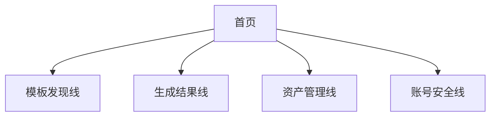
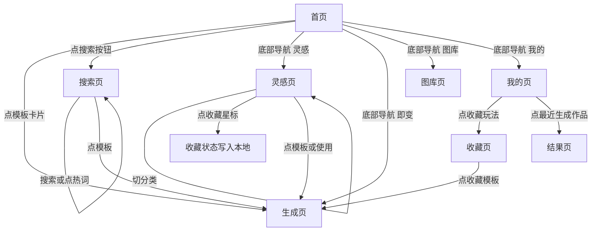
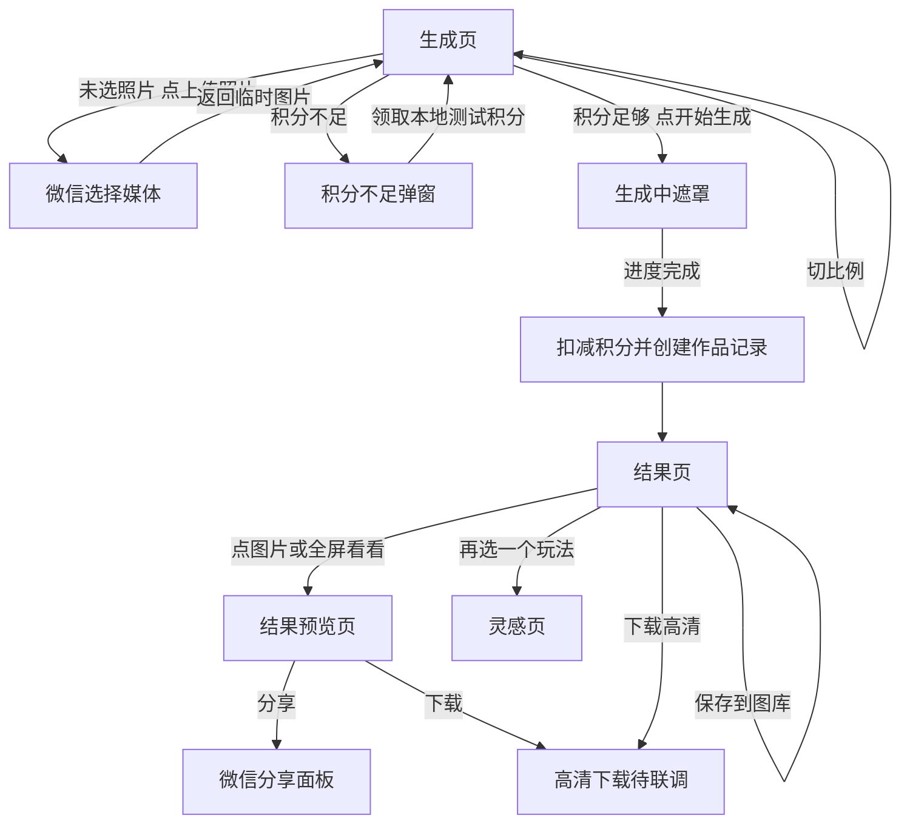
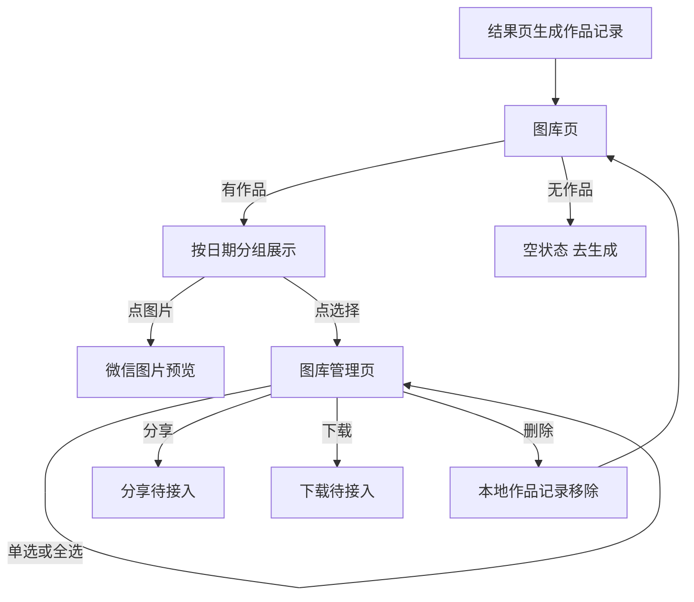
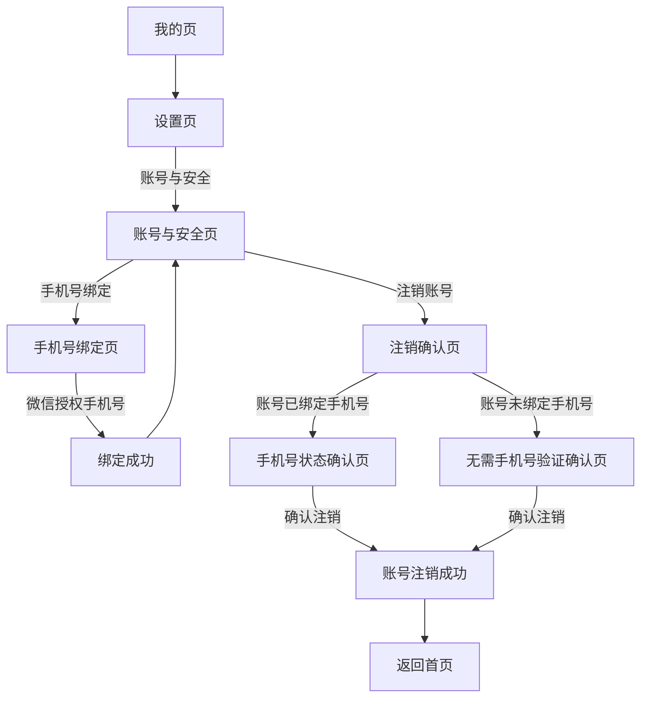
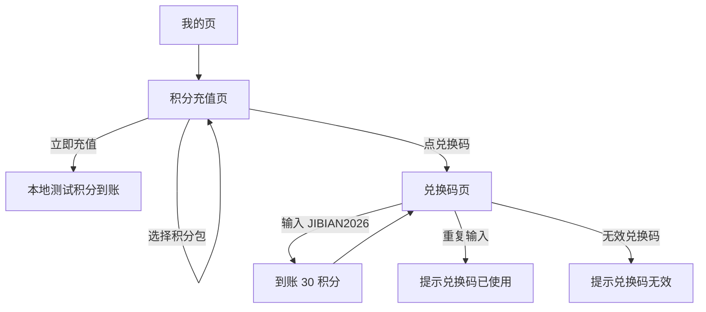

# 即变用户操作逻辑流程图

更新时间：2026年07月31日  
覆盖范围：微信小程序当前前端 UI，包括模板浏览、上传生成、结果预览、图库、收藏、积分、兑换码、账号安全与注销。

## 总览

当前小程序前端按 4 条主线闭环：

- `模板发现线`：首页、搜索、灵感、玩法库、收藏和最近生成都可以触达模板或作品。
- `生成结果线`：选模板、上传照片、生成中、结果页、图库和再次生成。
- `资产管理线`：图库查看、批量选择、删除，本地保存最近作品记录。
- `账号安全线`：手机号绑定、账号注销；未绑定手机号时不进入短信验证。

## 分支一：模板发现

## 分支二：上传生成

## 分支三：图库与作品管理

## 分支四：账号与安全

## 分支五：积分与兑换码

## 关键规则

- 模板点击后进入 `生成页`，由生成页承接上传、换模板、比例和生成动作。
- 一次生成必须创建一条独立 `作品记录`，不能再用 `template_id` 代替作品 ID。
- 结果页、图库页、我的页最近生成都读取同一份作品记录。
- 收藏状态只属于用户行为，灵感页点亮星标后，收藏页必须同步展示。
- 未绑定手机号的账号注销流程不进入短信验证码页。
- 已绑定手机号的账号注销流程必须展示脱敏手机号并要求验证码。
- 兑换码前端只保留可验证测试码，真实活动码校验后续必须走后端。
- 当前支付、高清下载、客服反馈、真实账号删除仍是前端占位，后续需要后端和微信能力接入。

## 当前前端完成度

- 已完成：模板浏览、上传入口、生成模拟、作品记录、结果页、结果预览页、图库展示、图库删除、收藏持久化、积分兑换码、手机号绑定状态、注销有无手机号分支。
- 待联调：微信登录、真实生成任务、云存储、支付、高清下载、分享回调、客服反馈、服务条款详情页。
